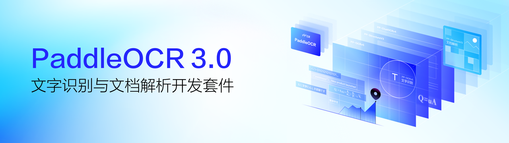

  

    
  

PaddleOCR自发布以来凭借学术前沿算法和产业落地实践，受到了产学研各方的喜爱，并被广泛应用于众多知名开源项目，例如：Umi-OCR、OmniParser、MinerU、RAGFlow等，已成为广大开发者心中的开源OCR领域的首选工具。2025年5月20日，飞桨团队发布**PaddleOCR 3.0**，全面适配[飞桨框架3.0](https://github.com/PaddlePaddle/Paddle)正式版，进一步**提升文字识别精度**，支持**多文字类型识别**和**手写体识别**，满足大模型应用对**复杂文档高精度解析**的旺盛需求，结合**文心大模型4.5**显著提升关键信息抽取精度，并新增**对昆仑芯、昇腾等国产硬件**的支持。

**2026 年 1 月 29 日，PaddleOCR 开源了先进、高效的文档解析模型 PaddleOCR-VL-1.5。** PaddleOCR-VL-1.5 是 PaddleOCR-VL 系列的全新迭代版本。在全面优化 1.0 版本核心能力的基础上，**该模型在文档解析权威评测集 OmniDocBench v1.5 上斩获了 94.5% 的高精度**，超越了全球的顶尖通用大模型及文档解析专用模型。

PaddleOCR-VL-1.5 创新性地支持了文档元素的异形框定位，使得 PaddleOCR-VL-1.5 在扫描、倾斜、弯折、屏幕拍摄及复杂光照等真实落地场景中均表现卓越，实现了全面的 SOTA。此外，模型进一步集成了印章识别与文本检测识别任务，关键指标持续领跑主流模型。

您可以在 [PaddleOCR官网](https://www.paddleocr.com) 在线使用或者调用该模型的API。

**PaddleOCR 3.x 核心特色能力：**

- **PaddleOCR-VL - 通过 0.9B 超紧凑视觉语言模型增强多语种文档解析**  
  **面向文档解析的 SOTA 且资源高效的模型**, 支持 109 种语言，在复杂元素（如文本、表格、公式和图表）识别方面表现出色，同时资源消耗极低。

- **PP-OCRv5 — 全场景文字识别**  
  **单模型支持五种文字类型**（简中、繁中、英文、日文及拼音），精度提升**13个百分点**。解决多语言混合文档的识别难题。

- **PP-StructureV3 — 复杂文档解析**  
  将复杂PDF和文档图像智能转换为保留**原始结构的Markdown文件和JSON**文件，在公开评测中**领先**众多商业方案。**完美保持文档版式和层次结构**。

- **PP-ChatOCRv4 — 智能信息抽取**  
  原生集成ERNIE 4.5，从海量文档中**精准提取关键信息**，精度较上一代提升15个百分点。让文档"**听懂**"您的问题并给出准确答案。

> 💡 Tips
> 
> PaddleOCR 官网免费 API 调用现已将每日文档解析上限提升至 20,000 页，支持大批量 PDF 文件解析，同时提供 MCP 及 Skills 服务。更多详情请参见 [PaddleOCR 官网](https://www.paddleocr.com)。

PaddleOCR 3.0除了提供优秀的模型库外，还提供好学易用的工具，覆盖模型训练、推理和服务化部署，方便开发者快速落地AI应用。

  

    
  

您可直接[快速开始](./quick_start.md)，或查阅完整的 [PaddleOCR 文档](https://paddlepaddle.github.io/PaddleOCR/main/index.html)，或通过 [Github Issues](https://github.com/PaddlePaddle/PaddleOCR/issues) 获取支持，或在 [AIStudio 课程平台](https://aistudio.baidu.com/course/introduce/25207) 探索我们的 OCR 课程。

**特别说明**：PaddleOCR 3.x 引入了多项重要的接口变动，**基于 PaddleOCR 2.x 编写的旧代码很可能无法使用 PaddleOCR 3.x 运行**。请确保您阅读的文档与实际使用的 PaddleOCR 版本匹配。[此文档](./update/upgrade_notes.md) 阐述了升级原因及 PaddleOCR 2.x 到 PaddleOCR 3.x 的主要变更。

## 🔄 快速一览运行效果

### PP-OCRv5

  

       
  

### PP-StructureV3

  

      
  

### PaddleOCR-VL

  

      
  

## 👩‍👩‍👧‍👦 PaddleOCR OCEAN 生态联盟

单点技术的领先只是开始，生态的繁荣才是长期价值所在。为了让 OCR 及文档智能技术更好地服务于全球开发者和产业场景，我们正式发起 PaddleOCR OCEAN 生态联盟。

联盟名称 OCEAN 蕴含五大核心：

  * **O**pen Source – 开源为本   
  * **C**ommunity – 社区驱动
  * **E**cosystem – 生态共赢
  * **A**pplication – 应用落地
  * **N**etwork – 网络互联

**定位**：以开源共建为核心的生态联盟，面向全球OCR及文档智能上下游伙伴，不涉及商业排他、不干预伙伴独立商业选择，聚焦技术共建、社区联动与影响力互换。以开放、共生、共赢为核心理念，汇聚开发者、平台方、应用方，共同推动 OCR 技术的全链条应用与生态繁荣。联盟致力于实现生态全链条应用规模与衍生项目数量的双重提升，让全球开发者与用户共享 OCR 技术发展的红利。

**加入我们：与志同道合者，共赴深水区**

PaddleOCR OCEAN生态联盟面向全球OCR及文档智能上下游伙伴开放。我们深知：**生态的价值不在于数量，而在于质量**。
我们期待这样的伙伴加入：

  * **真心认同开源精神**，愿意以开放的心态共建、共享
  * **具备持续贡献的意愿与能力**，无论是代码、场景案例还是平台集成
  * **愿意与联盟共同成长**，不追求短期流量，而是深耕长期价值

**联盟不是荣誉墙，而是行动者的集结号。**

我们将对每一份申请进行审慎评估，优先邀请那些已经在PaddleOCR生态中有所行动、或具备明确共建规划的伙伴。我们不追求“大而全”，而是希望与真正志同道合的机构和个人，在OCR深水区携手深耕。
如果您符合以上理念，欢迎通过以下方式与我们联系：

  * 发送邮件至 paddleocr@baidu.com，简要介绍您与PaddleOCR的合作情况或共建计划
