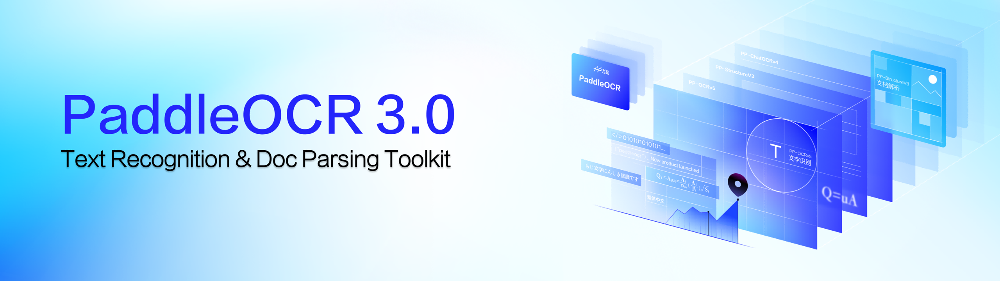
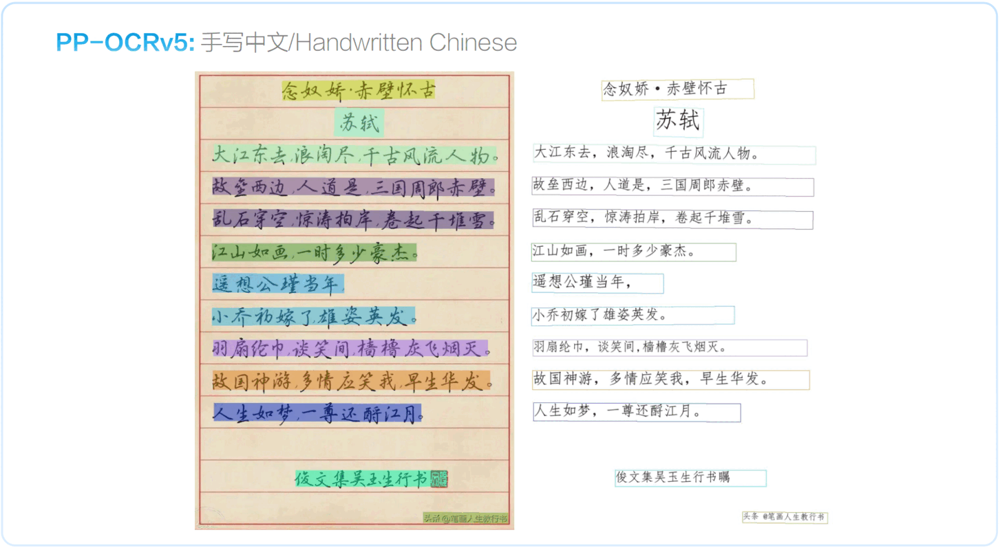
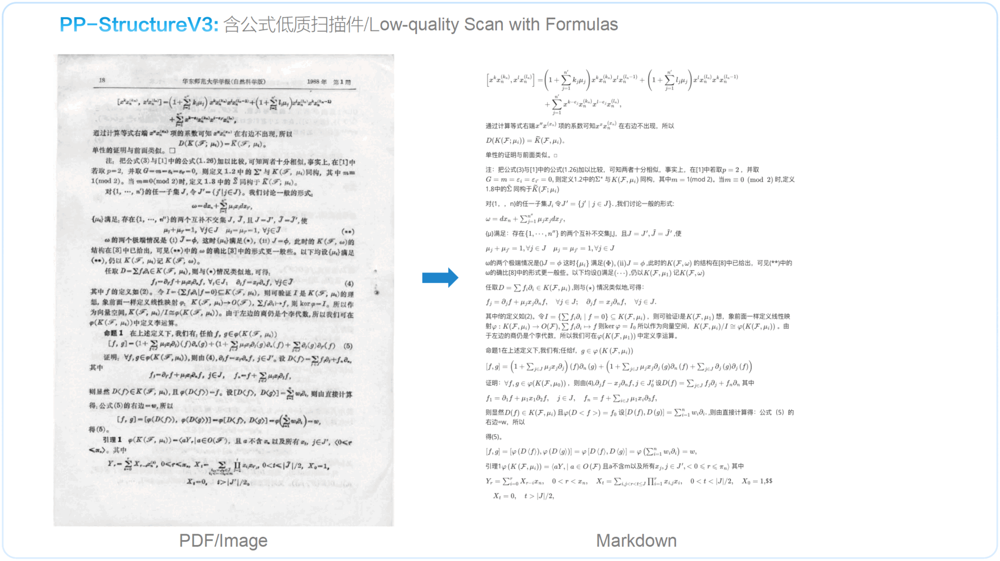

<div align="center">
  <p>
      
  </p>

<!-- language -->
[English](../README.md) | [简体中文](./README_cn.md) | [繁體中文](./README_tcn.md) | [日本語](./README_ja.md) | [한국어](./README_ko.md) | Français | [Русский](./README_ru.md) | [Español](./README_es.md) | [العربية](./README_ar.md)

<!-- icon -->

[](https://github.com/PaddlePaddle/PaddleOCR)
[](https://pypi.org/project/PaddleOCR/)


[![HuggingFace](https://img.shields.io/badge/PaddleOCR--VL-_Demo_on_HuggingFace-yellow?logo=data:image/png;base64,iVBORw0KGgoAAAANSUhEUgAAAF8AAABYCAMAAACkl9t/AAAAk1BMVEVHcEz/nQv/nQv/nQr/nQv/nQr/nQv/nQv/nQr/wRf/txT/pg7/yRr/rBD/zRz/ngv/oAz/zhz/nwv/txT/ngv/0B3+zBz/nQv/0h7/wxn/vRb/thXkuiT/rxH/pxD/ogzcqyf/nQvTlSz/czCxky7/SjifdjT/Mj3+Mj3wMj15aTnDNz+DSD9RTUBsP0FRO0Q6O0WyIxEIAAAAGHRSTlMADB8zSWF3krDDw8TJ1NbX5efv8ff9/fxKDJ9uAAAGKklEQVR42u2Z63qjOAyGC4RwCOfB2JAGqrSb2WnTw/1f3UaWcSGYNKTdf/P+mOkTrE+yJBulvfvLT2A5ruenaVHyIks33npl/6C4s/ZLAM45SOi/1FtZPyFur1OYofBX3w7d54Bxm+E8db+nDr12ttmESZ4zludJEG5S7TO72YPlKZFyE+YCYUJTBZsMiNS5Sd7NlDmKM2Eg2JQg8awbglfqgbhArjxkS7dgp2RH6hc9AMLdZYUtZN5DJr4molC8BfKrEkPKEnEVjLbgW1fLy77ZVOJagoIcLIl+IxaQZGjiX597HopF5CkaXVMDO9Pyix3AFV3kw4lQLCbHuMovz8FallbcQIJ5Ta0vks9RnolbCK84BtjKRS5uA43hYoZcOBGIG2Epbv6CvFVQ8m8loh66WNySsnN7htL58LNp+NXT8/PhXiBXPMjLSxtwp8W9f/1AngRierBkA+kk/IpUSOeKByzn8y3kAAAfh//0oXgV4roHm/kz4E2z//zRc3/lgwBzbM2mJxQEa5pqgX7d1L0htrhx7LKxOZlKbwcAWyEOWqYSI8YPtgDQVjpB5nvaHaSnBaQSD6hweDi8PosxD6/PT09YY3xQA7LTCTKfYX+QHpA0GCcqmEHvr/cyfKQTEuwgbs2kPxJEB0iNjfJcCTPyocx+A0griHSmADiC91oNGVwJ69RudYe65vJmoqfpul0lrqXadW0jFKH5BKwAeCq+Den7s+3zfRJzA61/Uj/9H/VzLKTx9jFPPdXeeP+L7WEvDLAKAIoF8bPTKT0+TM7W8ePj3Rz/Yn3kOAp2f1Kf0Weony7pn/cPydvhQYV+eFOfmOu7VB/ViPe34/EN3RFHY/yRuT8ddCtMPH/McBAT5s+vRde/gf2c/sPsjLK+m5IBQF5tO+h2tTlBGnP6693JdsvofjOPnnEHkh2TnV/X1fBl9S5zrwuwF8NFrAVJVwCAPTe8gaJlomqlp0pv4Pjn98tJ/t/fL++6unpR1YGC2n/KCoa0tTLoKiEeUPDl94nj+5/Tv3/eT5vBQ60X1S0oZr+IWRR8Ldhu7AlLjPISlJcO9vrFotky9SpzDequlwEir5beYAc0R7D9KS1DXva0jhYRDXoExPdc6yw5GShkZXe9QdO/uOvHofxjrV/TNS6iMJS+4TcSTgk9n5agJdBQbB//IfF/HpvPt3Tbi7b6I6K0R72p6ajryEJrENW2bbeVUGjfgoals4L443c7BEE4mJO2SpbRngxQrAKRudRzGQ8jVOL2qDVjjI8K1gc3TIJ5KiFZ1q+gdsARPB4NQS4AjwVSt72DSoXNyOWUrU5mQ9nRYyjp89Xo7oRI6Bga9QNT1mQ/ptaJq5T/7WcgAZywR/XlPGAUDdet3LE+qS0TI+g+aJU8MIqjo0Kx8Ly+maxLjJmjQ18rA0YCkxLQbUZP1WqdmyQGJLUm7VnQFqodmXSqmRrdVpqdzk5LvmvgtEcW8PMGdaS23EOWyDVbACZzUJPaqMbjDxpA3Qrgl0AikimGDbqmyT8P8NOYiqrldF8rX+YN7TopX4UoHuSCYY7cgX4gHwclQKl1zhx0THf+tCAUValzjI7Wg9EhptrkIcfIJjA94evOn8B2eHaVzvBrnl2ig0So6hvPaz0IGcOvTHvUIlE2+prqAxLSQxZlU2stql1NqCCLdIiIN/i1DBEHUoElM9dBravbiAnKqgpi4IBkw+utSPIoBijDXJipSVV7MpOEJUAc5Qmm3BnUN+w3hteEieYKfRZSIUcXKMVf0u5wD4EwsUNVvZOtUT7A2GkffHjByWpHqvRBYrTV72a6j8zZ6W0DTE86Hn04bmyWX3Ri9WH7ZU6Q7h+ZHo0nHUAcsQvVhXRDZHChwiyi/hnPuOsSEF6Exk3o6Y9DT1eZ+6cASXk2Y9k+6EOQMDGm6WBK10wOQJCBwren86cPPWUcRAnTVjGcU1LBgs9FURiX/e6479yZcLwCBmTxiawEwrOcleuu12t3tbLv/N4RLYIBhYexm7Fcn4OJcn0+zc+s8/VfPeddZHAGN6TT8eGczHdR/Gts1/MzDkThr23zqrVfAMFT33Nx1RJsx1k5zuWILLnG/vsH+Fv5D4NTVcp1Gzo8AAAAAElFTkSuQmCC&labelColor=white)](https://huggingface.co/spaces/PaddlePaddle/PaddleOCR-VL_Online_Demo)
[![AI Studio](https://img.shields.io/badge/PaddleOCR--VL-_Demo_on_AI_Studio-1927BA?logo=data:image/png;base64,iVBORw0KGgoAAAANSUhEUgAAAgAAAAIACAMAAADDpiTIAAAABlBMVEU2P+X///+1KuUwAAAHKklEQVR42u3dS5bjOAwEwALvf2fMavZum6IAImI7b2yYSqU+1Zb//gAAAAAAAAAAAAAAAAAAAAAAAAAAAAAAAAAAAAAAAAAAAAAAAAAAAAAAAAAAAAAAAAAAAAAAAAAAAAAAAADKCR/+fzly7rD92yVg69xh8zeLwOa5w+ZvFYHtc4ft3ykB++cOm79PAp6YO2z/Ngl4ZO5l+9+yT4QAvLqS748VF33Ylzdvzpl72f6z53YIGJ6SZdPeNHcIwOycaADdLgCSIgAIgCOAACAAykIAEAAEAAFAABCAT+WQuQVgeBqXhXQIQAAYegowLQBpbg3gZGFyAC6vgBQAMREA2/YfDPxyaDQNyTNz+3Zwn5J4ZG7PB2h0kHhi7plPCImmJwkPzO0RMa3OET0i5uGlzHFze0xcu0vE2Dq3J4U2vEPgSaHbFzPNDQAAAAAAAMBNovdw+cP/ny+uaf7w/+eYADy8kE+F4Offdjn6zZXhAXgiA78G4MNNsmnu1Xr7b3mbOL8T5Ja5bw/A35EC2LiWpzt1y9jRugBy30fLg3NvHPvnuZcC2NsCUXA/aRmA89V07Fwgt37uH8deCmBr6N44pP4UgaUATpdA7v/cMbIB8okliY65/SW5HhJ1ehPmM+8edwXgpbu4R88FayR32Y/P7oZZbOx13/Zr//ZHx27bAPnkFoyewYlbAhD3TvBobr95gaUAtr1EdNx1lgI4OcTTuR3z6+FZMEDRcu9ZCuDgGCdyGxMa4EgBRMvcjrkM7NgBZw5c0TwAUWUhZwRXA2xaya65Xa3jO2qYZ8bu2AD5w38tG5V8aZpoGN6Tz0bOfa9bceyWAciTO0jWyO1Tc5cLwJmF/JfPnXVyu3/slgHIg1n79O2O5fZv+1cHV7sC2HYqmUdHysNzX3sVkMcjUK5Gc+dMs28E5bGtm0V3gloBOP9vgZv+4sYn3RUaYFMCol5uN77g6lUApc8pWs69Zn7snS9Z9Q8G0S0AUTVUUTG3A54R1KSvo/diLAv5fKzynZeN6xogC75u93+AtBTA47OlAFSv6qY/vp3DAjD8iv2ZdFYJwKynMhTK1rInPfzaxW81LnvSgFP9KxrATaCLA3DxHpbFX31ZyNm5XRZyXG5bNkAWfP0rcrsUwOgC6NIAzgBcBiqAWwPgLrAGuGBP6jr2sifdfiJ6QQM4Bbw4AK4B3129ZSFn53ZZyA/GyFty27IBFMDFAXAG8PbyLQv5xULGPRl0K3h2AbwcgCZPhs+LD1zLnjS6AN4NwMU/DVFh7LyhASreTbvqrxdr/J4XT4Swz4FrTS+AGJ7bNbwAYkxuWzZAVljHrJfbjb9wviYXwFO/FJ8Vli4vaICsEMFyBbA3tmtsAUS0zG1c/bj4YwsZH2/+Whd0+1Nb+S7IE2sfPw4RL0XmsR8Nqvz7qFngmPHF34EqjP15AAofAkosZKPC/K6FVoeP02Ehi540NG6AK/4pYP3cLgVwXwHkDQ1QcSGb/uF4WwCmfX8u/+4vgLINcMUlQIfcLgXwXAF0+BGkpQDuuJx7/hwgpu//cWVuO3wxJOz/z8297vgYBwaIO3O7Kn+c194578ltywbIgu8fl+Z2lS+APvnLjnOv8hsgSqxjgwL4Ln9LAezaj98tgPzy7ZcC+GQzxrWxXQpgx370dm6/H7v6jaBoso5dY1swAFlwHWvfBf5pxVa93fCtdx64+1dsgCy4joWvAfPX9VoKYMs6Zse9/8Mlvv7LILlhAfKFFdsSutJXAdFkL3qlADJPrXFcXAC5KYaH586jO9mtAch9S3T0GQJ726ZWAE49kjP3rlDJuetdaL/1zeqZY9c7CRz7s0wCUPxienQBnAuAAtAAlxaAAAxfyBQABSAACkAAFIAAKAABUAACMEkKwL170oh7V8ueNLoAjgTAXWAN4BRwcABcA2oABTA4AApAAyiAwQFQABpAAQwOgALQADMWUgCuEmNyu15fSIY3gFPAiwPgFFADKIDBAVAAGkABCIACmBqAUAAaQAHMDUCMWkgBuMWw3K43F5LhDeAU8OIAuAmkARTA4AAoAA2gAARAAUwNgLvAGkABDA6Au8AaoKOJuV0vLSTDG8Ap4MUBcBNIAyiAwQFQABpAAQwOgALQAApAABTA1AC4C6wBOhqb23V+IRneAE4BLw6Aa0ANoAAGB0ABaAAFMDgACkADKAABUABTA+AusAboKATAQs4trjV+IYcfuJYCcA6gAATAQk69dFkKQANYyLkFcLIBFIDLQAVwawDsSRrAEWBwAJwCagAFMDgACkADKIDBAVAAGkABCIACmBoAzwXWAApgcADsSRrg0iNACoACEADXgAIwdCFTACykALgGFIAfl0kBAAAAAAAAAAAAAAAAAAAAAAAAAAAAAAAAAAAAAAAAAAAAAAAAAAAAAAAAAAAAAAAAAAAAAAAAAAAAAAAAAPBv/gN+IH8U6YveYgAAAABJRU5ErkJggg==&labelColor=white)](https://aistudio.baidu.com/application/detail/98365)
[![ModelScope](https://img.shields.io/badge/PaddleOCR--VL-_Demo_on_ModelScope-purple?logo=data:image/svg+xml;base64,PHN2ZyB3aWR0aD0iMjIzIiBoZWlnaHQ9IjIwMCIgeG1sbnM9Imh0dHA6Ly93d3cudzMub3JnLzIwMDAvc3ZnIj4KCiA8Zz4KICA8dGl0bGU+TGF5ZXIgMTwvdGl0bGU+CiAgPHBhdGggaWQ9InN2Z18xNCIgZmlsbD0iIzYyNGFmZiIgZD0ibTAsODkuODRsMjUuNjUsMGwwLDI1LjY0OTk5bC0yNS42NSwwbDAsLTI1LjY0OTk5eiIvPgogIDxwYXRoIGlkPSJzdmdfMTUiIGZpbGw9IiM2MjRhZmYiIGQ9Im05OS4xNCwxMTUuNDlsMjUuNjUsMGwwLDI1LjY1bC0yNS42NSwwbDAsLTI1LjY1eiIvPgogIDxwYXRoIGlkPSJzdmdfMTYiIGZpbGw9IiM2MjRhZmYiIGQ9Im0xNzYuMDksMTQxLjE0bC0yNS42NDk5OSwwbDAsMjIuMTlsNDcuODQsMGwwLC00Ny44NGwtMjIuMTksMGwwLDI1LjY1eiIvPgogIDxwYXRoIGlkPSJzdmdfMTciIGZpbGw9IiMzNmNmZDEiIGQ9Im0xMjQuNzksODkuODRsMjUuNjUsMGwwLDI1LjY0OTk5bC0yNS42NSwwbDAsLTI1LjY0OTk5eiIvPgogIDxwYXRoIGlkPSJzdmdfMTgiIGZpbGw9IiMzNmNmZDEiIGQ9Im0wLDY0LjE5bDI1LjY1LDBsMCwyNS42NWwtMjUuNjUsMGwwLC0yNS42NXoiLz4KICA8cGF0aCBpZD0ic3ZnXzE5IiBmaWxsPSIjNjI0YWZmIiBkPSJtMTk4LjI4LDg5Ljg0bDI1LjY0OTk5LDBsMCwyNS42NDk5OWwtMjUuNjQ5OTksMGwwLC0yNS42NDk5OXoiLz4KICA8cGF0aCBpZD0ic3ZnXzIwIiBmaWxsPSIjMzZjZmQxIiBkPSJtMTk4LjI4LDY0LjE5bDI1LjY0OTk5LDBsMCwyNS42NWwtMjUuNjQ5OTksMGwwLC0yNS42NXoiLz4KICA8cGF0aCBpZD0ic3ZnXzIxIiBmaWxsPSIjNjI0YWZmIiBkPSJtMTUwLjQ0LDQybDAsMjIuMTlsMjUuNjQ5OTksMGwwLDI1LjY1bDIyLjE5LDBsMCwtNDcuODRsLTQ3Ljg0LDB6Ii8+CiAgPHBhdGggaWQ9InN2Z18yMiIgZmlsbD0iIzM2Y2ZkMSIgZD0ibTczLjQ5LDg5Ljg0bDI1LjY1LDBsMCwyNS42NDk5OWwtMjUuNjUsMGwwLC0yNS42NDk5OXoiLz4KICA8cGF0aCBpZD0ic3ZnXzIzIiBmaWxsPSIjNjI0YWZmIiBkPSJtNDcuODQsNjQuMTlsMjUuNjUsMGwwLC0yMi4xOWwtNDcuODQsMGwwLDQ3Ljg0bDIyLjE5LDBsMCwtMjUuNjV6Ii8+CiAgPHBhdGggaWQ9InN2Z18yNCIgZmlsbD0iIzYyNGFmZiIgZD0ibTQ3Ljg0LDExNS40OWwtMjIuMTksMGwwLDQ3Ljg0bDQ3Ljg0LDBsMCwtMjIuMTlsLTI1LjY1LDBsMCwtMjUuNjV6Ii8+CiA8L2c+Cjwvc3ZnPg==&labelColor=white)](https://www.modelscope.cn/studios/PaddlePaddle/PaddleOCR-VL_Online_Demo)

[![AI Studio](https://img.shields.io/badge/PP--OCRv5-Demo_on_AI_Studio-1927BA?logo=data:image/png;base64,iVBORw0KGgoAAAANSUhEUgAAAgAAAAIACAMAAADDpiTIAAAABlBMVEU2P+X///+1KuUwAAAHKklEQVR42u3dS5bjOAwEwALvf2fMavZum6IAImI7b2yYSqU+1Zb//gAAAAAAAAAAAAAAAAAAAAAAAAAAAAAAAAAAAAAAAAAAAAAAAAAAAAAAAAAAAAAAAAAAAAAAAAAAAAAAAADKCR/+fzly7rD92yVg69xh8zeLwOa5w+ZvFYHtc4ft3ykB++cOm79PAp6YO2z/Ngl4ZO5l+9+yT4QAvLqS748VF33Ylzdvzpl72f6z53YIGJ6SZdPeNHcIwOycaADdLgCSIgAIgCOAACAAykIAEAAEAAFAABCAT+WQuQVgeBqXhXQIQAAYegowLQBpbg3gZGFyAC6vgBQAMREA2/YfDPxyaDQNyTNz+3Zwn5J4ZG7PB2h0kHhi7plPCImmJwkPzO0RMa3OET0i5uGlzHFze0xcu0vE2Dq3J4U2vEPgSaHbFzPNDQAAAAAAAMBNovdw+cP/ny+uaf7w/+eYADy8kE+F4Offdjn6zZXhAXgiA78G4MNNsmnu1Xr7b3mbOL8T5Ja5bw/A35EC2LiWpzt1y9jRugBy30fLg3NvHPvnuZcC2NsCUXA/aRmA89V07Fwgt37uH8deCmBr6N44pP4UgaUATpdA7v/cMbIB8okliY65/SW5HhJ1ehPmM+8edwXgpbu4R88FayR32Y/P7oZZbOx13/Zr//ZHx27bAPnkFoyewYlbAhD3TvBobr95gaUAtr1EdNx1lgI4OcTTuR3z6+FZMEDRcu9ZCuDgGCdyGxMa4EgBRMvcjrkM7NgBZw5c0TwAUWUhZwRXA2xaya65Xa3jO2qYZ8bu2AD5w38tG5V8aZpoGN6Tz0bOfa9bceyWAciTO0jWyO1Tc5cLwJmF/JfPnXVyu3/slgHIg1n79O2O5fZv+1cHV7sC2HYqmUdHysNzX3sVkMcjUK5Gc+dMs28E5bGtm0V3gloBOP9vgZv+4sYn3RUaYFMCol5uN77g6lUApc8pWs69Zn7snS9Z9Q8G0S0AUTVUUTG3A54R1KSvo/diLAv5fKzynZeN6xogC75u93+AtBTA47OlAFSv6qY/vp3DAjD8iv2ZdFYJwKynMhTK1rInPfzaxW81LnvSgFP9KxrATaCLA3DxHpbFX31ZyNm5XRZyXG5bNkAWfP0rcrsUwOgC6NIAzgBcBiqAWwPgLrAGuGBP6jr2sifdfiJ6QQM4Bbw4AK4B3129ZSFn53ZZyA/GyFty27IBFMDFAXAG8PbyLQv5xULGPRl0K3h2AbwcgCZPhs+LD1zLnjS6AN4NwMU/DVFh7LyhASreTbvqrxdr/J4XT4Swz4FrTS+AGJ7bNbwAYkxuWzZAVljHrJfbjb9wviYXwFO/FJ8Vli4vaICsEMFyBbA3tmtsAUS0zG1c/bj4YwsZH2/+Whd0+1Nb+S7IE2sfPw4RL0XmsR8Nqvz7qFngmPHF34EqjP15AAofAkosZKPC/K6FVoeP02Ehi540NG6AK/4pYP3cLgVwXwHkDQ1QcSGb/uF4WwCmfX8u/+4vgLINcMUlQIfcLgXwXAF0+BGkpQDuuJx7/hwgpu//cWVuO3wxJOz/z8297vgYBwaIO3O7Kn+c194578ltywbIgu8fl+Z2lS+APvnLjnOv8hsgSqxjgwL4Ln9LAezaj98tgPzy7ZcC+GQzxrWxXQpgx370dm6/H7v6jaBoso5dY1swAFlwHWvfBf5pxVa93fCtdx64+1dsgCy4joWvAfPX9VoKYMs6Zse9/8Mlvv7LILlhAfKFFdsSutJXAdFkL3qlADJPrXFcXAC5KYaH586jO9mtAch9S3T0GQJ726ZWAE49kjP3rlDJuetdaL/1zeqZY9c7CRz7s0wCUPxienQBnAuAAtAAlxaAAAxfyBQABSAACkAAFIAAKAABUAACMEkKwL170oh7V8ueNLoAjgTAXWAN4BRwcABcA2oABTA4AApAAyiAwQFQABpAAQwOgALQADMWUgCuEmNyu15fSIY3gFPAiwPgFFADKIDBAVAAGkABCIACmBqAUAAaQAHMDUCMWkgBuMWw3K43F5LhDeAU8OIAuAmkARTA4AAoAA2gAARAAUwNgLvAGkABDA6Au8AaoKOJuV0vLSTDG8Ap4MUBcBNIAyiAwQFQABpAAQwOgALQAApAABTA1AC4C6wBOhqb23V+IRneAE4BLw6Aa0ANoAAGB0ABaAAFMDgACkADKAABUABTA+AusAboKATAQs4trjV+IYcfuJYCcA6gAATAQk69dFkKQANYyLkFcLIBFIDLQAVwawDsSRrAEWBwAJwCagAFMDgACkADKIDBAVAAGkABCIACmBoAzwXWAApgcADsSRrg0iNACoACEADXgAIwdCFTACykALgGFIAfl0kBAAAAAAAAAAAAAAAAAAAAAAAAAAAAAAAAAAAAAAAAAAAAAAAAAAAAAAAAAAAAAAAAAAAAAAAAAAAAAAAAAPBv/gN+IH8U6YveYgAAAABJRU5ErkJggg==&labelColor=white)](https://aistudio.baidu.com/community/app/91660/webUI)
[![AI Studio](https://img.shields.io/badge/PP--StructureV3-Demo_on_AI_Studio-1927BA?logo=data:image/png;base64,iVBORw0KGgoAAAANSUhEUgAAAgAAAAIACAMAAADDpiTIAAAABlBMVEU2P+X///+1KuUwAAAHKklEQVR42u3dS5bjOAwEwALvf2fMavZum6IAImI7b2yYSqU+1Zb//gAAAAAAAAAAAAAAAAAAAAAAAAAAAAAAAAAAAAAAAAAAAAAAAAAAAAAAAAAAAAAAAAAAAAAAAAAAAAAAAADKCR/+fzly7rD92yVg69xh8zeLwOa5w+ZvFYHtc4ft3ykB++cOm79PAp6YO2z/Ngl4ZO5l+9+yT4QAvLqS748VF33Ylzdvzpl72f6z53YIGJ6SZdPeNHcIwOycaADdLgCSIgAIgCOAACAAykIAEAAEAAFAABCAT+WQuQVgeBqXhXQIQAAYegowLQBpbg3gZGFyAC6vgBQAMREA2/YfDPxyaDQNyTNz+3Zwn5J4ZG7PB2h0kHhi7plPCImmJwkPzO0RMa3OET0i5uGlzHFze0xcu0vE2Dq3J4U2vEPgSaHbFzPNDQAAAAAAAMBNovdw+cP/ny+uaf7w/+eYADy8kE+F4Offdjn6zZXhAXgiA78G4MNNsmnu1Xr7b3mbOL8T5Ja5bw/A35EC2LiWpzt1y9jRugBy30fLg3NvHPvnuZcC2NsCUXA/aRmA89V07Fwgt37uH8deCmBr6N44pP4UgaUATpdA7v/cMbIB8okliY65/SW5HhJ1ehPmM+8edwXgpbu4R88FayR32Y/P7oZZbOx13/Zr//ZHx27bAPnkFoyewYlbAhD3TvBobr95gaUAtr1EdNx1lgI4OcTTuR3z6+FZMEDRcu9ZCuDgGCdyGxMa4EgBRMvcjrkM7NgBZw5c0TwAUWUhZwRXA2xaya65Xa3jO2qYZ8bu2AD5w38tG5V8aZpoGN6Tz0bOfa9bceyWAciTO0jWyO1Tc5cLwJmF/JfPnXVyu3/slgHIg1n79O2O5fZv+1cHV7sC2HYqmUdHysNzX3sVkMcjUK5Gc+dMs28E5bGtm0V3gloBOP9vgZv+4sYn3RUaYFMCol5uN77g6lUApc8pWs69Zn7snS9Z9Q8G0S0AUTVUUTG3A54R1KSvo/diLAv5fKzynZeN6xogC75u93+AtBTA47OlAFSv6qY/vp3DAjD8iv2ZdFYJwKynMhTK1rInPfzaxW81LnvSgFP9KxrATaCLA3DxHpbFX31ZyNm5XRZyXG5bNkAWfP0rcrsUwOgC6NIAzgBcBiqAWwPgLrAGuGBP6jr2sifdfiJ6QQM4Bbw4AK4B3129ZSFn53ZZyA/GyFty27IBFMDFAXAG8PbyLQv5xULGPRl0K3h2AbwcgCZPhs+LD1zLnjS6AN4NwMU/DVFh7LyhASreTbvqrxdr/J4XT4Swz4FrTS+AGJ7bNbwAYkxuWzZAVljHrJfbjb9wviYXwFO/FJ8Vli4vaICsEMFyBbA3tmtsAUS0zG1c/bj4YwsZH2/+Whd0+1Nb+S7IE2sfPw4RL0XmsR8Nqvz7qFngmPHF34EqjP15AAofAkosZKPC/K6FVoeP02Ehi540NG6AK/4pYP3cLgVwXwHkDQ1QcSGb/uF4WwCmfX8u/+4vgLINcMUlQIfcLgXwXAF0+BGkpQDuuJx7/hwgpu//cWVuO3wxJOz/z8297vgYBwaIO3O7Kn+c194578ltywbIgu8fl+Z2lS+APvnLjnOv8hsgSqxjgwL4Ln9LAezaj98tgPzy7ZcC+GQzxrWxXQpgx370dm6/H7v6jaBoso5dY1swAFlwHWvfBf5pxVa93fCtdx64+1dsgCy4joWvAfPX9VoKYMs6Zse9/8Mlvv7LILlhAfKFFdsSutJXAdFkL3qlADJPrXFcXAC5KYaH586jO9mtAch9S3T0GQJ726ZWAE49kjP3rlDJuetdaL/1zeqZY9c7CRz7s0wCUPxienQBnAuAAtAAlxaAAAxfyBQABSAACkAAFIAAKAABUAACMEkKwL170oh7V8ueNLoAjgTAXWAN4BRwcABcA2oABTA4AApAAyiAwQFQABpAAQwOgALQADMWUgCuEmNyu15fSIY3gFPAiwPgFFADKIDBAVAAGkABCIACmBqAUAAaQAHMDUCMWkgBuMWw3K43F5LhDeAU8OIAuAmkARTA4AAoAA2gAARAAUwNgLvAGkABDA6Au8AaoKOJuV0vLSTDG8Ap4MUBcBNIAyiAwQFQABpAAQwOgALQAApAABTA1AC4C6wBOhqb23V+IRneAE4BLw6Aa0ANoAAGB0ABaAAFMDgACkADKAABUABTA+AusAboKATAQs4trjV+IYcfuJYCcA6gAATAQk69dFkKQANYyLkFcLIBFIDLQAVwawDsSRrAEWBwAJwCagAFMDgACkADKIDBAVAAGkABCIACmBoAzwXWAApgcADsSRrg0iNACoACEADXgAIwdCFTACykALgGFIAfl0kBAAAAAAAAAAAAAAAAAAAAAAAAAAAAAAAAAAAAAAAAAAAAAAAAAAAAAAAAAAAAAAAAAAAAAAAAAAAAAAAAAPBv/gN+IH8U6YveYgAAAABJRU5ErkJggg==&labelColor=white)](https://aistudio.baidu.com/community/app/518494/webUI)
[![AI Studio](https://img.shields.io/badge/PP--ChatOCRv4-Demo_on_AI_Studio-1927BA?logo=data:image/png;base64,iVBORw0KGgoAAAANSUhEUgAAAgAAAAIACAMAAADDpiTIAAAABlBMVEU2P+X///+1KuUwAAAHKklEQVR42u3dS5bjOAwEwALvf2fMavZum6IAImI7b2yYSqU+1Zb//gAAAAAAAAAAAAAAAAAAAAAAAAAAAAAAAAAAAAAAAAAAAAAAAAAAAAAAAAAAAAAAAAAAAAAAAAAAAAAAAADKCR/+fzly7rD92yVg69xh8zeLwOa5w+ZvFYHtc4ft3ykB++cOm79PAp6YO2z/Ngl4ZO5l+9+yT4QAvLqS748VF33Ylzdvzpl72f6z53YIGJ6SZdPeNHcIwOycaADdLgCSIgAIgCOAACAAykIAEAAEAAFAABCAT+WQuQVgeBqXhXQIQAAYegowLQBpbg3gZGFyAC6vgBQAMREA2/YfDPxyaDQNyTNz+3Zwn5J4ZG7PB2h0kHhi7plPCImmJwkPzO0RMa3OET0i5uGlzHFze0xcu0vE2Dq3J4U2vEPgSaHbFzPNDQAAAAAAAMBNovdw+cP/ny+uaf7w/+eYADy8kE+F4Offdjn6zZXhAXgiA78G4MNNsmnu1Xr7b3mbOL8T5Ja5bw/A35EC2LiWpzt1y9jRugBy30fLg3NvHPvnuZcC2NsCUXA/aRmA89V07Fwgt37uH8deCmBr6N44pP4UgaUATpdA7v/cMbIB8okliY65/SW5HhJ1ehPmM+8edwXgpbu4R88FayR32Y/P7oZZbOx13/Zr//ZHx27bAPnkFoyewYlbAhD3TvBobr95gaUAtr1EdNx1lgI4OcTTuR3z6+FZMEDRcu9ZCuDgGCdyGxMa4EgBRMvcjrkM7NgBZw5c0TwAUWUhZwRXA2xaya65Xa3jO2qYZ8bu2AD5w38tG5V8aZpoGN6Tz0bOfa9bceyWAciTO0jWyO1Tc5cLwJmF/JfPnXVyu3/slgHIg1n79O2O5fZv+1cHV7sC2HYqmUdHysNzX3sVkMcjUK5Gc+dMs28E5bGtm0V3gloBOP9vgZv+4sYn3RUaYFMCol5uN77g6lUApc8pWs69Zn7snS9Z9Q8G0S0AUTVUUTG3A54R1KSvo/diLAv5fKzynZeN6xogC75u93+AtBTA47OlAFSv6qY/vp3DAjD8iv2ZdFYJwKynMhTK1rInPfzaxW81LnvSgFP9KxrATaCLA3DxHpbFX31ZyNm5XRZyXG5bNkAWfP0rcrsUwOgC6NIAzgBcBiqAWwPgLrAGuGBP6jr2sifdfiJ6QQM4Bbw4AK4B3129ZSFn53ZZyA/GyFty27IBFMDFAXAG8PbyLQv5xULGPRl0K3h2AbwcgCZPhs+LD1zLnjS6AN4NwMU/DVFh7LyhASreTbvqrxdr/J4XT4Swz4FrTS+AGJ7bNbwAYkxuWzZAVljHrJfbjb9wviYXwFO/FJ8Vli4vaICsEMFyBbA3tmtsAUS0zG1c/bj4YwsZH2/+Whd0+1Nb+S7IE2sfPw4RL0XmsR8Nqvz7qFngmPHF34EqjP15AAofAkosZKPC/K6FVoeP02Ehi540NG6AK/4pYP3cLgVwXwHkDQ1QcSGb/uF4WwCmfX8u/+4vgLINcMUlQIfcLgXwXAF0+BGkpQDuuJx7/hwgpu//cWVuO3wxJOz/z8297vgYBwaIO3O7Kn+c194578ltywbIgu8fl+Z2lS+APvnLjnOv8hsgSqxjgwL4Ln9LAezaj98tgPzy7ZcC+GQzxrWxXQpgx370dm6/H7v6jaBoso5dY1swAFlwHWvfBf5pxVa93fCtdx64+1dsgCy4joWvAfPX9VoKYMs6Zse9/8Mlvv7LILlhAfKFFdsSutJXAdFkL3qlADJPrXFcXAC5KYaH586jO9mtAch9S3T0GQJ726ZWAE49kjP3rlDJuetdaL/1zeqZY9c7CRz7s0wCUPxienQBnAuAAtAAlxaAAAxfyBQABSAACkAAFIAAKAABUAACMEkKwL170oh7V8ueNLoAjgTAXWAN4BRwcABcA2oABTA4AApAAyiAwQFQABpAAQwOgALQADMWUgCuEmNyu15fSIY3gFPAiwPgFFADKIDBAVAAGkABCIACmBqAUAAaQAHMDUCMWkgBuMWw3K43F5LhDeAU8OIAuAmkARTA4AAoAA2gAARAAUwNgLvAGkABDA6Au8AaoKOJuV0vLSTDG8Ap4MUBcBNIAyiAwQFQABpAAQwOgALQAApAABTA1AC4C6wBOhqb23V+IRneAE4BLw6Aa0ANoAAGB0ABaAAFMDgACkADKAABUABTA+AusAboKATAQs4trjV+IYcfuJYCcA6gAATAQk69dFkKQANYyLkFcLIBFIDLQAVwawDsSRrAEWBwAJwCagAFMDgACkADKIDBAVAAGkABCIACmBoAzwXWAApgcADsSRrg0iNACoACEADXgAIwdCFTACykALgGFIAfl0kBAAAAAAAAAAAAAAAAAAAAAAAAAAAAAAAAAAAAAAAAAAAAAAAAAAAAAAAAAAAAAAAAAAAAAAAAAAAAAAAAAPBv/gN+IH8U6YveYgAAAABJRU5ErkJggg==&labelColor=white)](https://aistudio.baidu.com/community/app/518493/webUI)

</div>

## 🚀 Introduction
Depuis sa sortie initiale, PaddleOCR a été largement acclamé par les milieux universitaires, industriels et de la recherche, grâce à ses algorithmes de pointe et à ses performances éprouvées dans des applications réelles. Il alimente déjà des projets open-source populaires tels que Umi-OCR, OmniParser, MinerU et RAGFlow, ce qui en fait la boîte à outils OCR de référence pour les développeurs du monde entier.

Le 20 mai 2025, l'équipe de PaddlePaddle a dévoilé PaddleOCR 3.0, entièrement compatible avec la version officielle du framework **PaddlePaddle 3.0**. Cette mise à jour **améliore encore la précision de la reconnaissance de texte**, ajoute la prise en charge de la **reconnaissance de multiples types de texte** et de la **reconnaissance de l'écriture manuscrite**, et répond à la demande croissante des applications de grands modèles pour l'**analyse de haute précision de documents complexes**. Combiné avec **ERNIE 4.5**, il améliore considérablement la précision de l'extraction d'informations clés. Pour la documentation d'utilisation complète, veuillez vous référer à la [Documentation de PaddleOCR 3.0](https://paddlepaddle.github.io/PaddleOCR/latest/en/index.html).

Trois nouvelles fonctionnalités majeures dans PaddleOCR 3.0 :
- Modèle de reconnaissance de texte pour toutes scènes [PP-OCRv5](../docs/version3.x/algorithm/PP-OCRv5/PP-OCRv5.en.md) : Un modèle unique qui gère cinq types de texte différents ainsi que l'écriture manuscrite complexe. La précision globale de la reconnaissance a augmenté de 13 points de pourcentage par rapport à la génération précédente. [Démo en ligne](https://aistudio.baidu.com/community/app/91660/webUI)

- Solution d'analyse de documents générique [PP-StructureV3](../docs/version3.x/algorithm/PP-StructureV3/PP-StructureV3.en.md) : Fournit une analyse de haute précision des PDF multi-mises en page et multi-scènes, surpassant de nombreuses solutions open-source et propriétaires sur les benchmarks publics. [Démo en ligne](https://aistudio.baidu.com/community/app/518494/webUI)

- Solution de compréhension de documents intelligente [PP-ChatOCRv4](../docs/version3.x/algorithm/PP-ChatOCRv4/PP-ChatOCRv4.en.md) : Nativement propulsé par le grand modèle ERNIE 4.5, atteignant une précision supérieure de 15 points de pourcentage à celle de son prédécesseur. [Démo en ligne](https://aistudio.baidu.com/community/app/518493/webUI)

En plus de fournir une bibliothèque de modèles exceptionnelle, PaddleOCR 3.0 propose également des outils conviviaux couvrant l'entraînement de modèles, l'inférence et le déploiement de services, afin que les développeurs puissent rapidement mettre en production des applications d'IA.
<div align="center">
  <p>
      
  </p>
</div>

**Remarque spéciale** : PaddleOCR 3.x introduit plusieurs changements importants d’interface. **L'ancien code écrit sur la base de PaddleOCR 2.x est probablement incompatible avec PaddleOCR 3.x**. Veuillez vous assurer que la documentation que vous consultez correspond à la version de PaddleOCR que vous utilisez. [Ce document](https://paddlepaddle.github.io/PaddleOCR/latest/en/update/upgrade_notes.html) explique les raisons de la mise à niveau et les principaux changements entre PaddleOCR 2.x et 3.x.

## 📣 Mises à jour récentes

#### **🔥🔥 16/10/2025 : PaddleOCR 3.3.0 publié**, comprenant :

**Lancement de PaddleOCR-VL :**
- **Présentation du modèle :**
    - PaddleOCR-VL est un modèle de pointe (SOTA) efficace en ressources, spécialisé dans l’analyse de documents. Au cœur de la solution, PaddleOCR-VL-0.9B est un modèle vision-langage (VLM) compact et puissant qui intègre un encodeur visuel à résolution dynamique de type NaViT et un modèle linguistique ERNIE-4.5-0.3B, permettant une reconnaissance précise des éléments. Ce modèle innovant prend en charge 109 langues et excelle dans la reconnaissance d’éléments complexes (texte, tableaux, formules, graphiques, etc.), tout en minimisant la consommation de ressources. Des évaluations complètes sur des benchmarks publics et internes montrent que PaddleOCR-VL atteint des performances SOTA tant pour l’analyse documentaire au niveau de la page qu’au niveau des éléments, surpassant largement les solutions existantes. Il rivalise également avec les meilleurs VLM et offre une vitesse d’inférence rapide, ce qui le rend très adapté à une utilisation en production. Le modèle est disponible en téléchargement et en utilisation sur [HuggingFace](https://huggingface.co/PaddlePaddle/PaddleOCR-VL).

- **Principales caractéristiques :**
    - Architecture vision-langage compacte et puissante : propose un nouveau modèle vision-langage efficace en ressources, spécialement conçu pour une inférence efficace et des performances exceptionnelles en reconnaissance d’éléments. Il combine un encodeur visuel dynamique de haute résolution de type NaViT et un modèle linguistique ERNIE-4.5-0.3B léger, améliorant considérablement la capacité de reconnaissance et l’efficacité du décodage. Cette intégration réduit le coût de calcul tout en maintenant une grande précision, idéale pour des applications de traitement documentaire efficaces et pratiques.
    - Performances SOTA en analyse documentaire : PaddleOCR-VL atteint des performances de pointe tant pour l’analyse documentaire au niveau de la page que pour la reconnaissance au niveau des éléments. Il surpasse largement les solutions traditionnelles basées sur des pipelines et rivalise efficacement avec les principaux modèles vision-langage (VLM). Il excelle dans la reconnaissance d’éléments complexes comme les textes, tableaux, formules, graphiques, et peut traiter du contenu difficile tel que l’écriture manuscrite ou les documents historiques. Cela lui confère une grande polyvalence, s’adaptant à de nombreux types et scénarios de documents.
    - Prise en charge multilingue : PaddleOCR-VL prend en charge 109 langues, y compris les principales langues du monde (chinois, anglais, japonais, latin, coréen, etc.), ainsi que le russe (cyrillique), l’arabe, l’hindi (devanagari), le thaïlandais et d’autres systèmes d’écriture et structures linguistiques. Ce large support multilingue est un atout majeur pour le traitement de documents à l’échelle mondiale et multilingue.

**Lancement du modèle multilingue PP-OCRv5 :**
- Améliore la précision et la couverture de la reconnaissance des caractères latins, et ajoute la prise en charge du cyrillique, de l’arabe, du devanagari, du télougou, du tamoul, etc. Au total, la reconnaissance couvre 109 langues ; le modèle ne compte que 2 millions de paramètres, et dans certains cas, la précision est améliorée de plus de 40 % par rapport à la génération précédente.

#### **🔥🔥21/08/2025 : Sortie de PaddleOCR 3.2.0**, comprend :

- **Ajouts majeurs de modèles :**
    - Ajout de l’entraînement, de l’inférence et du déploiement des modèles de reconnaissance PP-OCRv5 en anglais, thaï et grec. **Le modèle anglais PP-OCRv5 offre une amélioration de 11 % dans les scénarios anglophones par rapport au modèle principal PP-OCRv5, tandis que les modèles de reconnaissance thaï et grec atteignent respectivement des précisions de 82,68 % et 89,28 %.**

- **Améliorations des capacités de déploiement :**
    - **Support complet des versions 3.1.0 et 3.1.1 du framework PaddlePaddle.**
    - **Mise à niveau complète de la solution de déploiement local PP-OCRv5 en C++ : compatible Linux et Windows, avec des fonctionnalités et une précision identiques à la version Python.**
    - **Prise en charge des inférences haute performance via CUDA 12, avec possibilité d’utiliser Paddle Inference ou le backend ONNX Runtime.**
    - **La solution de déploiement orientée service, hautement stable, est désormais entièrement open source, permettant aux utilisateurs de personnaliser les images Docker et les SDK selon leurs besoins.**
    - Cette solution prend également en charge l’appel via des requêtes HTTP construites manuellement, permettant le développement du client dans n’importe quel langage de programmation.

- **Support du benchmark :**
    - **Toutes les chaînes de production prennent désormais en charge des benchmarks fins, permettant de mesurer le temps d’inférence de bout en bout ainsi que les temps d’exécution par couche et par module, ce qui facilite l’analyse des performances.[Voici](../docs/version3.x/pipeline_usage/instructions/benchmark.en.md) comment configurer et utiliser la fonctionnalité de benchmark**
    - **La documentation fournit désormais des indicateurs clés (temps d’inférence, occupation mémoire, etc.) sur le matériel courant pour différentes configurations, offrant ainsi des références pour le déploiement.**

- **Corrections de bugs :**
    - Correction d’un problème d’enregistrement des journaux d’entraînement du modèle.
    - Mise à jour de la partie augmentation de données du modèle de formule pour garantir la compatibilité avec les nouvelles versions de la dépendance albumentations, et correction d’un avertissement de blocage lors de l’utilisation du package tokenizers en mode multiprocessus.
    - Correction de l’incohérence du comportement de certains interrupteurs (comme `use_chart_parsing`) dans les fichiers de configuration de PP-StructureV3 par rapport aux autres chaînes de production.

- **Autres améliorations :**
    - **Séparation des dépendances essentielles et optionnelles : seules les dépendances de base sont nécessaires pour la reconnaissance de texte, tandis que les fonctionnalités avancées (analyse documentaire, extraction d’information, etc.) requièrent l’installation de dépendances supplémentaires selon les besoins.**
    - **Prise en charge des cartes graphiques NVIDIA série 50 sous Windows ; les utilisateurs peuvent consulter le [guide d’installation](../docs/version3.x/installation.en.md) pour installer la version appropriée du framework Paddle.**
    - **Les modèles de la série PP-OCR peuvent désormais retourner les coordonnées de chaque caractère individuellement.**
    - Ajout de nouvelles sources de téléchargement des modèles, telles qu’AIStudio et ModelScope, avec la possibilité de spécifier la source désirée.
    - Ajout du support pour la conversion de graphique vers tableau via le module PP-Chart2Table.
    - Optimisation de certaines descriptions de la documentation pour améliorer la facilité d’utilisation.

#### **15/08/2025 : Sortie de PaddleOCR 3.1.1**, comprend :

- **Corrections de bugs :**
  - Ajout des méthodes manquantes `save_vector`, `save_visual_info_list`, `load_vector`, `load_visual_info_list` à la classe `PP-ChatOCRv4`.
  - Ajout des paramètres manquants `glossary` et `llm_request_interval` à la méthode `translate` de la classe `PPDocTranslation`.

- **Optimisation de la documentation :**
  - Ajout d’une démo à la documentation MCP.
  - Ajout des précisions sur les versions du framework PaddlePaddle et de PaddleOCR utilisées pour les tests des indicateurs de performance.
  - Correction des erreurs et oublis dans la documentation de la ligne de production de traduction de documents.

- **Autres :**
  - Modification des dépendances du serveur MCP : utilisation de la bibliothèque pure Python `puremagic` à la place de `python-magic` pour réduire les problèmes d'installation.
  - Retest des indicateurs de performance de PP-OCRv5 avec la version 3.1.0 de PaddleOCR et mise à jour de la documentation.

#### **29/06/2025 : Sortie de PaddleOCR 3.1.0**, comprend :

- **Modèles et pipelines principaux :**
  - **Ajout du modèle de reconnaissance de texte multilingue PP-OCRv5**, prenant en charge l'entraînement et l'inférence pour 37 langues, dont le français, l'espagnol, le portugais, le russe, le coréen, etc. **Précision moyenne améliorée de plus de 30 %.** [Détails](https://paddlepaddle.github.io/PaddleOCR/latest/en/version3.x/algorithm/PP-OCRv5/PP-OCRv5_multi_languages.html)
  - Mise à niveau du **modèle PP-Chart2Table** dans PP-StructureV3, améliorant davantage la conversion des graphiques en tableaux. Sur des ensembles d'évaluation internes personnalisés, la métrique (RMS-F1) **a augmenté de 9,36 points de pourcentage (71,24 % -> 80,60 %).**
  - Lancement du **pipeline de traduction de documents, PP-DocTranslation, basé sur PP-StructureV3 et ERNIE 4.5**, prenant en charge la traduction des documents au format Markdown, des PDF à mise en page complexe, et des images de documents, avec sauvegarde des résultats au format Markdown. [Détails](https://paddlepaddle.github.io/PaddleOCR/latest/en/version3.x/pipeline_usage/PP-DocTranslation.html)

- **Nouveau serveur MCP :** [Details](https://paddlepaddle.github.io/PaddleOCR/latest/en/version3.x/deployment/mcp_server.html)
  - **Prend en charge les pipelines OCR et PP-StructureV3.**
  - Prend en charge trois modes de fonctionnement : bibliothèque Python locale, service cloud communautaire AIStudio et service auto-hébergé.
  - Prend en charge l'appel des services locaux via stdio et des services distants via Streamable HTTP.

- **Optimisation de la documentation :** Amélioration des descriptions dans certains guides utilisateurs pour une expérience de lecture plus fluide.


<details>
    <summary><strong>Historique des mises à jour</strong></summary>

#### **26/06/2025 : Publication de PaddleOCR 3.0.3, incluant :**

- Correction de bug : Résolution du problème où le paramètre `enable_mkldnn` ne fonctionnait pas, rétablissant le comportement par défaut d'utilisation de MKL-DNN pour l'inférence CPU.

#### 🔥🔥**19/06/2025 : Publication de PaddleOCR 3.0.2, incluant :**

- **Nouvelles fonctionnalités :**

  - La source de téléchargement par défaut a été changée de `BOS` à `HuggingFace`. Les utilisateurs peuvent également changer la variable d'environnement `PADDLE_PDX_MODEL_SOURCE` en `BOS` pour rétablir la source de téléchargement sur Baidu Object Storage (BOS).
  - Ajout d'exemples d'appel de service pour six langues — C++, Java, Go, C#, Node.js et PHP — pour les pipelines tels que PP-OCRv5, PP-StructureV3 et PP-ChatOCRv4.
  - Amélioration de l'algorithme de tri de partition de mise en page dans le pipeline PP-StructureV3, améliorant la logique de tri pour les mises en page verticales complexes afin de fournir de meilleurs résultats.
  - Logique de sélection de modèle améliorée : lorsqu'une langue est spécifiée mais pas une version de modèle, le système sélectionnera automatiquement la dernière version du modèle prenant en charge cette langue. 
  - Définition d'une limite supérieure par défaut pour la taille du cache MKL-DNN afin d'éviter une croissance illimitée, tout en permettant aux utilisateurs de configurer la capacité du cache.
  - Mise à jour des configurations par défaut pour l'inférence haute performance afin de prendre en charge l'accélération Paddle MKL-DNN et optimisation de la logique de sélection automatique de la configuration pour des choix plus intelligents.
  - Ajustement de la logique d'obtention du périphérique par défaut pour tenir compte du support réel des dispositifs de calcul par le framework Paddle installé, rendant le comportement du programme plus intuitif.
  - Ajout d'un exemple Android pour PP-OCRv5. [Détails](https://paddlepaddle.github.io/PaddleOCR/latest/en/version3.x/deployment/on_device_deployment.html).

- **Corrections de bugs :**

  - Correction d'un problème où certains paramètres CLI dans PP-StructureV3 ne prenaient pas effet.
  - Résolution d'un problème où `export_paddlex_config_to_yaml` ne fonctionnait pas correctement dans certains cas.
  - Correction de l'écart entre le comportement réel de `save_path` et sa description dans la documentation.
  - Correction d'erreurs potentielles de multithreading lors de l'utilisation de MKL-DNN dans le déploiement de services de base.
  - Correction des erreurs d'ordre des canaux dans le prétraitement des images pour le modèle Latex-OCR.
  - Correction des erreurs d'ordre des canaux lors de la sauvegarde des images visualisées dans le module de reconnaissance de texte.
  - Résolution des erreurs d'ordre des canaux dans les résultats de tableaux visualisés dans le pipeline PP-StructureV3.
  - Correction d'un problème de débordement dans le calcul de `overlap_ratio` dans des circonstances très spéciales dans le pipeline PP-StructureV3.

- **Améliorations de la documentation :**

  - Mise à jour de la description du paramètre `enable_mkldnn` dans la documentation pour refléter précisément le comportement réel du programme.
  - Correction d'erreurs dans la documentation concernant les paramètres `lang` et `ocr_version`.
  - Ajout d'instructions pour l'exportation des fichiers de configuration de la ligne de production via CLI.
  - Correction des colonnes manquantes dans le tableau de données de performance pour PP-OCRv5.
  - Affinement des métriques de benchmark pour PP-StructureV3 pour différentes configurations.

- **Autres :**

  - Assouplissement des restrictions de version sur les dépendances comme numpy et pandas, restaurant la prise en charge de Python 3.12.

#### **🔥🔥 05/06/2025 : Publication de PaddleOCR 3.0.1, incluant :**

- **Optimisation de certains modèles et de leurs configurations :**
  - Mise à jour de la configuration par défaut du modèle pour PP-OCRv5, en passant les modèles de détection et de reconnaissance de `mobile` à `server`. Pour améliorer les performances par défaut dans la plupart des scénarios, le paramètre `limit_side_len` dans la configuration a été changé de 736 à 64.
  - Ajout d'un nouveau modèle de classification de l'orientation des lignes de texte `PP-LCNet_x1_0_textline_ori` avec une précision de 99.42%. Le classifieur d'orientation de ligne de texte par défaut pour les pipelines OCR, PP-StructureV3 et PP-ChatOCRv4 a été mis à jour vers ce modèle.
  - Optimisation du modèle de classification de l'orientation des lignes de texte `PP-LCNet_x0_25_textline_ori`, améliorant la précision de 3,3 points de pourcentage pour atteindre une précision actuelle de 98,85%.

- **Optimisations et corrections de certains problèmes de la version 3.0.0, [détails](https://paddlepaddle.github.io/PaddleOCR/latest/en/update/update.html)**

🔥🔥20/05/2025 : Lancement officiel de **PaddleOCR v3.0**, incluant :
- **PP-OCRv5** : Modèle de reconnaissance de texte de haute précision pour tous les scénarios - Texte instantané à partir d'images/PDF.
   1. 🌐 Prise en charge par un seul modèle de **cinq** types de texte - Traitez de manière transparente le **chinois simplifié, le chinois traditionnel, le pinyin chinois simplifié, l'anglais** et le **japonais** au sein d'un seul modèle.
   2. ✍️ **Reconnaissance de l'écriture manuscrite** améliorée : Nettement plus performant sur les écritures cursives complexes et non standard.
   3. 🎯 **Gain de précision de 13 points** par rapport à PP-OCRv4, atteignant des performances de pointe dans une variété de scénarios réels.

- **PP-StructureV3** : Analyse de documents à usage général – Libérez une analyse d'images/PDF de pointe pour des scénarios du monde réel !
   1. 🧮 **Analyse de PDF multi-scènes de haute précision**, devançant les solutions open-source et propriétaires sur le benchmark OmniDocBench.
   2. 🧠 Les capacités spécialisées incluent la **reconnaissance de sceaux**, la **conversion de graphiques en tableaux**, la **reconnaissance de tableaux avec formules/images imbriquées**, l'**analyse de documents à texte vertical** et l'**analyse de structures de tableaux complexes**.

- **PP-ChatOCRv4** : Compréhension intelligente de documents – Extrayez des informations clés, pas seulement du texte, à partir d'images/PDF.
   1. 🔥 **Gain de précision de 15 points** dans l'extraction d'informations clés sur les fichiers PDF/PNG/JPG par rapport à la génération précédente.
   2. 💻 Prise en charge native de **ERNIE 4.5**, avec une compatibilité pour les déploiements de grands modèles via PaddleNLP, Ollama, vLLM, et plus encore.
   3. 🤝 Intégration de [PP-DocBee2](https://github.com/PaddlePaddle/PaddleMIX/tree/develop/paddlemix/examples/ppdocbee2), permettant l'extraction et la compréhension de texte imprimé, d'écriture manuscrite, de sceaux, de tableaux, de graphiques et d'autres éléments courants dans les documents complexes.

[Historique des mises à jour](https://paddlepaddle.github.io/PaddleOCR/latest/en/update/update.html)

</details>

## ⚡ Démarrage Rapide
### 1. Lancer la démo en ligne
[](https://aistudio.baidu.com/community/app/91660/webUI)
[](https://aistudio.baidu.com/community/app/518494/webUI)
[](https://aistudio.baidu.com/community/app/518493/webUI)

### 2. Installation

Installez PaddlePaddle en vous référant au [Guide d'installation](https://www.paddlepaddle.org.cn/en/install/quick?docurl=/documentation/docs/en/develop/install/pip/linux-pip_en.html), puis installez la boîte à outils PaddleOCR.

```bash
# Si vous souhaitez uniquement utiliser la fonction de reconnaissance de texte de base (retourne les coordonnées de position et le contenu du texte), y compris la série PP-OCR
python -m pip install paddleocr
# Si vous souhaitez utiliser toutes les fonctionnalités telles que l’analyse de documents, la compréhension de documents, la traduction de documents, l’extraction d’informations clés, etc.
# python -m pip install "paddleocr[all]"
```

À partir de la version 3.2.0, en plus du groupe de dépendances `all` présenté ci-dessus, PaddleOCR prend également en charge l’installation de certaines fonctionnalités optionnelles en spécifiant d’autres groupes de dépendances. Voici tous les groupes de dépendances proposés par PaddleOCR :

| Nom du groupe de dépendances | Fonctionnalité correspondante |
| - | - |
| `doc-parser` | Analyse de documents : peut être utilisée pour extraire des éléments de mise en page tels que des tableaux, des formules, des tampons, des images, etc. à partir de documents ; inclut des modèles comme PP-StructureV3, PaddleOCR-VL. |
| `ie` | Extraction d’informations : permet d’extraire des informations clés des documents, telles que noms, dates, adresses, montants, etc. ; inclut des modèles comme PP-ChatOCRv4 |
| `trans` | Traduction de documents : permet de traduire des documents d’une langue à une autre ; inclut des modèles comme PP-DocTranslation |
| `all` | Fonctionnalité complète |

### 3. Exécuter l'inférence par CLI
```bash
# Exécuter l'inférence PP-OCRv5
paddleocr ocr -i https://paddle-model-ecology.bj.bcebos.com/paddlex/imgs/demo_image/general_ocr_002.png --use_doc_orientation_classify False --use_doc_unwarping False --use_textline_orientation False

# Exécuter l'inférence PP-StructureV3
paddleocr pp_structurev3 -i https://paddle-model-ecology.bj.bcebos.com/paddlex/imgs/demo_image/pp_structure_v3_demo.png --use_doc_orientation_classify False --use_doc_unwarping False

# Obtenez d'abord la clé API Qianfan, puis exécutez l'inférence PP-ChatOCRv4
paddleocr pp_chatocrv4_doc -i https://paddle-model-ecology.bj.bcebos.com/paddlex/imgs/demo_image/vehicle_certificate-1.png -k 驾驶室准乘人数 --qianfan_api_key your_api_key --use_doc_orientation_classify False --use_doc_unwarping False

# Exécuter l'inférence PaddleOCR-VL
paddleocr doc_parser -i https://paddle-model-ecology.bj.bcebos.com/paddlex/imgs/demo_image/paddleocr_vl_demo.png

# Obtenir plus d'informations sur "paddleocr ocr"
paddleocr ocr --help
```

### 4. Exécuter l'inférence par API
**4.1 Exemple PP-OCRv5**
```python
# Initialiser l'instance de PaddleOCR
from paddleocr import PaddleOCR
ocr = PaddleOCR(
    use_doc_orientation_classify=False,
    use_doc_unwarping=False,
    use_textline_orientation=False)

# Exécuter l'inférence OCR sur un exemple d'image
result = ocr.predict(
    input="https://paddle-model-ecology.bj.bcebos.com/paddlex/imgs/demo_image/general_ocr_002.png")

# Visualiser les résultats et sauvegarder les résultats JSON
for res in result:
    res.print()
    res.save_to_img("output")
    res.save_to_json("output")
```

<details>
    <summary><strong>4.2 Exemple PP-StructureV3</strong></summary>

```python
from pathlib import Path
from paddleocr import PPStructureV3

pipeline = PPStructureV3(
    use_doc_orientation_classify=False,
    use_doc_unwarping=False
)

# Pour une image
output = pipeline.predict(
    input="https://paddle-model-ecology.bj.bcebos.com/paddlex/imgs/demo_image/pp_structure_v3_demo.png",
)

# Visualiser les résultats et sauvegarder les résultats JSON
for res in output:
    res.print() 
    res.save_to_json(save_path="output") 
    res.save_to_markdown(save_path="output")           
```

</details>

<details>
   <summary><strong>4.3 Exemple PP-ChatOCRv4</strong></summary>

```python
from paddleocr import PPChatOCRv4Doc

chat_bot_config = {
    "module_name": "chat_bot",
    "model_name": "ernie-3.5-8k",
    "base_url": "https://qianfan.baidubce.com/v2",
    "api_type": "openai",
    "api_key": "api_key",  # votre api_key
}

retriever_config = {
    "module_name": "retriever",
    "model_name": "embedding-v1",
    "base_url": "https://qianfan.baidubce.com/v2",
    "api_type": "qianfan",
    "api_key": "api_key",  # votre api_key
}

pipeline = PPChatOCRv4Doc(
    use_doc_orientation_classify=False,
    use_doc_unwarping=False
)

visual_predict_res = pipeline.visual_predict(
    input="https://paddle-model-ecology.bj.bcebos.com/paddlex/imgs/demo_image/vehicle_certificate-1.png",
    use_common_ocr=True,
    use_seal_recognition=True,
    use_table_recognition=True,
)

mllm_predict_info = None
use_mllm = False
# Si un grand modèle multimodal est utilisé, le service mllm local doit être démarré. Vous pouvez vous référer à la documentation : https://github.com/PaddlePaddle/PaddleX/blob/release/3.0/docs/pipeline_usage/tutorials/vlm_pipelines/doc_understanding.en.md pour effectuer le déploiement et mettre à jour la configuration mllm_chat_bot_config.
if use_mllm:
    mllm_chat_bot_config = {
        "module_name": "chat_bot",
        "model_name": "PP-DocBee",
        "base_url": "http://127.0.0.1:8080/",  # url de votre service mllm local
        "api_type": "openai",
        "api_key": "api_key",  # votre api_key
    }

    mllm_predict_res = pipeline.mllm_pred(
        input="https://paddle-model-ecology.bj.bcebos.com/paddlex/imgs/demo_image/vehicle_certificate-1.png",
        key_list=["驾驶室准乘人数"],
        mllm_chat_bot_config=mllm_chat_bot_config,
    )
    mllm_predict_info = mllm_predict_res["mllm_res"]

visual_info_list = []
for res in visual_predict_res:
    visual_info_list.append(res["visual_info"])
    layout_parsing_result = res["layout_parsing_result"]

vector_info = pipeline.build_vector(
    visual_info_list, flag_save_bytes_vector=True, retriever_config=retriever_config
)
chat_result = pipeline.chat(
    key_list=["驾驶室准乘人数"],
    visual_info=visual_info_list,
    vector_info=vector_info,
    mllm_predict_info=mllm_predict_info,
    chat_bot_config=chat_bot_config,
    retriever_config=retriever_config,
)
print(chat_result)
```

</details>

<details>
   <summary><strong>4.4 Exemple PaddleOCR-VL</strong></summary>

```python
from paddleocr import PaddleOCRVL

pipeline = PaddleOCRVL()
output = pipeline.predict("https://paddle-model-ecology.bj.bcebos.com/paddlex/imgs/demo_image/paddleocr_vl_demo.png")
for res in output:
    res.print()
    res.save_to_json(save_path="output")
    res.save_to_markdown(save_path="output")
```

</details>

## 🧩 Fonctionnalités supplémentaires

- Convertir les modèles au format ONNX : [Obtention des modèles ONNX](https://paddlepaddle.github.io/PaddleOCR/latest/en/version3.x/deployment/obtaining_onnx_models.html).
- Accélérer l'inférence avec des moteurs comme OpenVINO, ONNX Runtime, TensorRT, ou effectuer l'inférence avec des modèles au format ONNX : [Inférence haute performance](https://paddlepaddle.github.io/PaddleOCR/latest/en/version3.x/deployment/high_performance_inference.html).
- Accélérer l'inférence en utilisant plusieurs GPU et plusieurs processus : [Inférence parallèle pour pipelines](https://paddlepaddle.github.io/PaddleOCR/latest/en/version3.x/pipeline_usage/instructions/parallel_inference.html).
- Intégrez PaddleOCR dans des applications écrites en C++, C#, Java, etc. : [Service](https://paddlepaddle.github.io/PaddleOCR/latest/en/version3.x/deployment/serving.html).

## ⛰️ Tutoriels avancés
- [Tutoriel PP-OCRv5](https://paddlepaddle.github.io/PaddleOCR/latest/version3.x/pipeline_usage/OCR.html)
- [Tutoriel PP-StructureV3](https://paddlepaddle.github.io/PaddleOCR/latest/version3.x/pipeline_usage/PP-StructureV3.html)
- [Tutoriel PP-ChatOCRv4](https://paddlepaddle.github.io/PaddleOCR/latest/version3.x/pipeline_usage/PP-ChatOCRv4.html)
- [Tutoriel PaddleOCR-VL](https://paddlepaddle.github.io/PaddleOCR/latest/version3.x/pipeline_usage/PaddleOCR-VL.html)

## 🔄 Aperçu rapide des résultats d'exécution

<div align="center">
  <p>
     
  </p>
</div>

<div align="center">
  <p>
     
  </p>
</div>

## 🌟 Restez à l'écoute

⭐ **Ajoutez une étoile à ce dépôt pour suivre les mises à jour passionnantes et les nouvelles versions, y compris de puissantes fonctionnalités d'OCR et d'analyse de documents !** ⭐

<div align="center">
  <p>
       
  </p>
</div>

## 👩‍👩‍👧‍👦 Communauté

| Compte officiel WeChat de PaddlePaddle | Rejoignez le groupe de discussion technique |
| :---: | :---: |
|  |  |

## 😃 Projets formidables utilisant PaddleOCR
PaddleOCR ne serait pas là où il est aujourd'hui sans son incroyable communauté ! 💗 Un immense merci à tous nos partenaires de longue date, nos nouveaux collaborateurs, et tous ceux qui ont mis leur passion dans PaddleOCR — que nous vous ayons nommés ou non. Votre soutien nous anime !

| Nom du projet | Description |
| ------------ | ----------- |
| [RAGFlow](https://github.com/infiniflow/ragflow) <a href="https://github.com/infiniflow/ragflow"></a>|Moteur RAG basé sur la compréhension profonde des documents.|
| [pathway](https://github.com/pathwaycom/pathway) <a href="https://github.com/pathwaycom/pathway"></a>|Un framework ETL Python pour le traitement des flux, l’analyse en temps réel, les pipelines LLM et le RAG.|
| [MinerU](https://github.com/opendatalab/MinerU) <a href="https://github.com/opendatalab/MinerU"></a>|Outil de conversion de documents multi-types en Markdown|
| [Umi-OCR](https://github.com/hiroi-sora/Umi-OCR) <a href="https://github.com/hiroi-sora/Umi-OCR"></a>|Logiciel d'OCR hors ligne, gratuit, open-source et par lots.|
| [cherry-studio](https://github.com/CherryHQ/cherry-studio) <a href="https://github.com/CherryHQ/cherry-studio"></a>|Un client de bureau prenant en charge plusieurs fournisseurs de LLM.|
| [OmniParser](https://github.com/microsoft/OmniParser)<a href="https://github.com/microsoft/OmniParser"></a>|Outil d'analyse d'écran pour agent GUI basé sur la vision pure.|
| [QAnything](https://github.com/netease-youdao/QAnything)<a href="https://github.com/netease-youdao/QAnything"></a>|Questions et réponses basées sur n'importe quel contenu.|
| [PDF-Extract-Kit](https://github.com/opendatalab/PDF-Extract-Kit) <a href="https://github.com/opendatalab/PDF-Extract-Kit"></a>|Une puissante boîte à outils open-source conçue pour extraire efficacement du contenu de haute qualité à partir de documents PDF complexes et diversifiés.|
| [Dango-Translator](https://github.com/PantsuDango/Dango-Translator)<a href="https://github.com/PantsuDango/Dango-Translator"></a>|Reconnaît le texte à l'écran, le traduit et affiche les résultats de la traduction en temps réel.|
| [En savoir plus](../awesome_projects.md) | [Plus de projets basés sur PaddleOCR](../awesome_projects.md)|

## 👩‍👩‍👧‍👦 Contributeurs

<a href="https://github.com/PaddlePaddle/PaddleOCR/graphs/contributors">
  
</a>

## 🌟 Star

[](https://star-history.com/#PaddlePaddle/PaddleOCR&Date)

## 📄 Licence
Ce projet est publié sous la [licence Apache 2.0](LICENSE).

## 🎓 Citation

```bibtex
@misc{cui2025paddleocr30technicalreport,
      title={PaddleOCR 3.0 Technical Report}, 
      author={Cheng Cui and Ting Sun and Manhui Lin and Tingquan Gao and Yubo Zhang and Jiaxuan Liu and Xueqing Wang and Zelun Zhang and Changda Zhou and Hongen Liu and Yue Zhang and Wenyu Lv and Kui Huang and Yichao Zhang and Jing Zhang and Jun Zhang and Yi Liu and Dianhai Yu and Yanjun Ma},
      year={2025},
      eprint={2507.05595},
      archivePrefix={arXiv},
      primaryClass={cs.CV},
      url={https://arxiv.org/abs/2507.05595}, 
}

@misc{cui2025paddleocrvlboostingmultilingualdocument,
      title={PaddleOCR-VL: Boosting Multilingual Document Parsing via a 0.9B Ultra-Compact Vision-Language Model}, 
      author={Cheng Cui and Ting Sun and Suyin Liang and Tingquan Gao and Zelun Zhang and Jiaxuan Liu and Xueqing Wang and Changda Zhou and Hongen Liu and Manhui Lin and Yue Zhang and Yubo Zhang and Handong Zheng and Jing Zhang and Jun Zhang and Yi Liu and Dianhai Yu and Yanjun Ma},
      year={2025},
      eprint={2510.14528},
      archivePrefix={arXiv},
      primaryClass={cs.CV},
      url={https://arxiv.org/abs/2510.14528}, 
}
```
